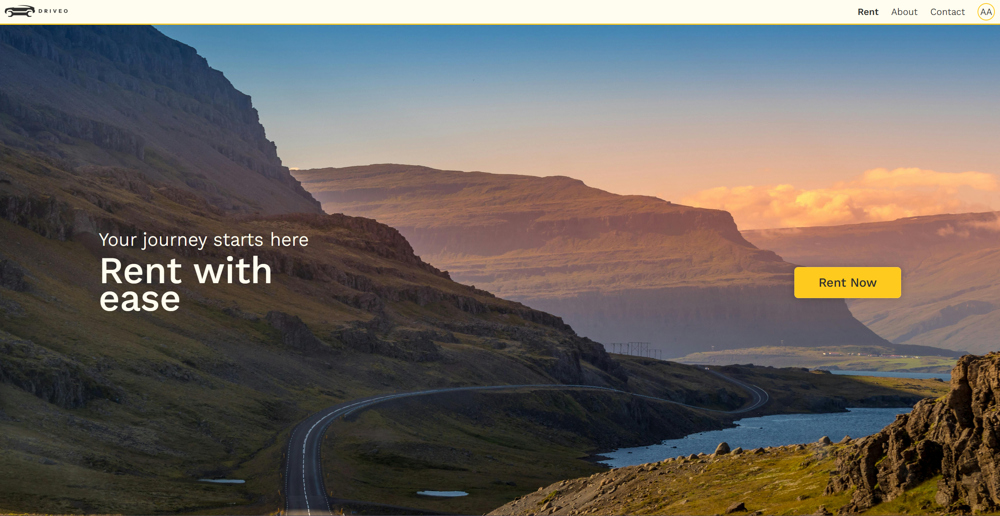
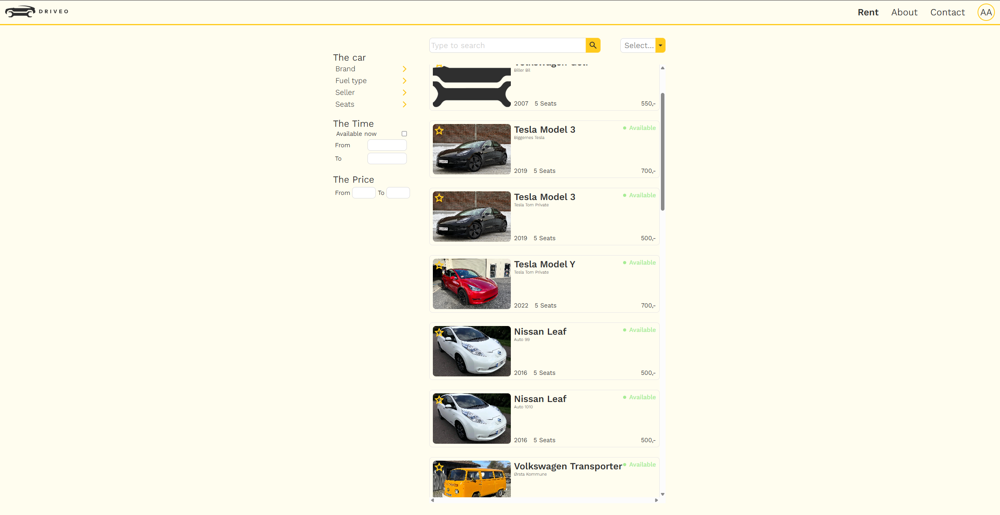
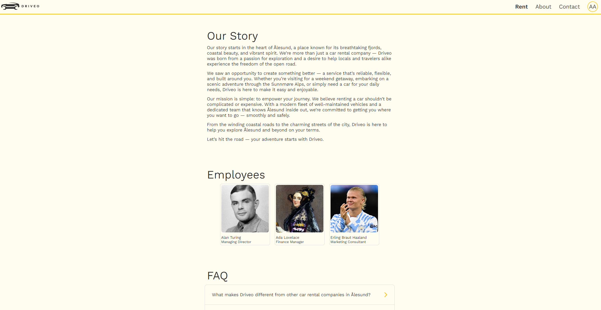

# Driveo - Frontend

## Introduction
This repository contains the frontend of the Driveo application. This application was developed as a part of the finals project in subjects [IDATA2301](https://www.ntnu.edu/studies/courses/IDATA2301#tab=omEmnet) and [IDATA2306](https://www.ntnu.edu/studies/courses/IDATA2306#tab=omEmnet).

The project is a simple car rental application where companies go to advertise their cars.

### Contributors
| Student Name     | GitHub account                              | Email Account           |
| -----------------|---------------------------------------------|-------------------------|
|Kristian Garder   | [Kristian54](https://github.com/Kristian54) | kristian.garder@ntnu.no |
|Ludvik Lund-Hole  | [ludlun04](https://github.com/ludlun04)     | ludviklu@stud.ntnu.no   |
|Stian Øye Jenssen | [Grade123](https://github.com/Grade123)     | stianoj@stud.ntnu.no    |

## How To run

### Prerequisites:
- Node (With npm)
- Web browser
- Spring backend running

### Run The Application
1. Open terminal and navigate to the root of the project
2. Run ``npm start``
3. Open web browser and nagivate to [localhost:3000](http://localhost:3000)

## Live demo
The application is currently deployed on an ntnu sourced server.
[Click here to view running website](https://idata.stianoj.no)

## Screenshots from the application
Landing Page:

Portal Page:

About Page:

